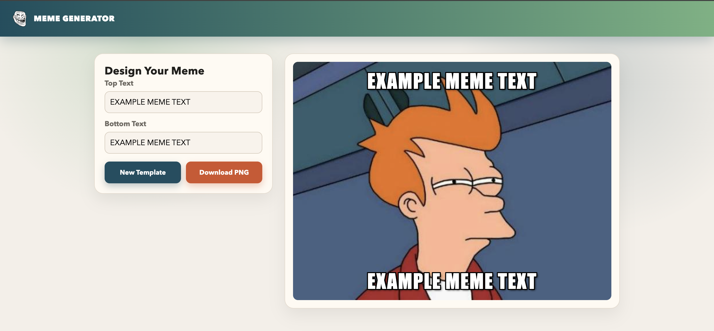

# Meme Studio


A modern meme generator built with React and Vite. Pick random templates, add custom top and bottom captions, and export your final meme as a PNG image in one click.

---

## How It Works

1. The app fetches meme templates from the Imgflip API.
2. Click New Template to randomly choose a meme image.
3. Add your top and bottom text in the input fields.
4. The preview updates instantly as you type.
5. Click Download PNG to save your meme.

---

## Preview

<p align="center">
  
</p>

---

## Live Demo

Try it here:

https://yamankadoura.github.io/meme-generator/

---

## Features

- Random meme template selection from the Imgflip API
- Live top and bottom caption editing
- Meme-style text rendering with outline and shadow
- Download final meme as PNG using canvas export
- Loading states for template fetch and image export
- Friendly error messages when image export is blocked
- Clean, responsive layout for desktop and mobile
- Accessible form labels and improved UI structure
- Fast development workflow with Vite

---

## Technologies

- React 19
- Vite 6
- JavaScript (ES Modules)
- CSS3
- Imgflip API
- React Hooks
- HTML Canvas API

---

## Project Structure

```text
meme-generator/
|
|- public/
|
|- src/
|  |- components/
|  |  |- Header.jsx
|  |  |- Main.jsx
|  |
|  |- images/
|  |
|  |- App.jsx
|  |- index.css
|  |- index.jsx
|
|- eslint.config.js
|- index.html
|- package.json
|- README.md
|- vite.config.js
```

---

## Getting Started

Clone the repository:

```bash
git clone https://github.com/your-username/meme-generator.git
```

Navigate into the project:

```bash
cd meme-generator
```

Install dependencies:

```bash
npm install
```

---

## Run Locally

Start the development server:

```bash
npm run dev
```

Open your browser:

```text
http://localhost:5173
```

Build for production:

```bash
npm run build
```

Preview production build:

```bash
npm run preview
```

Run lint checks:

```bash
npm run lint
```

---

## Notes

- Meme templates are loaded from https://api.imgflip.com/get_memes.
